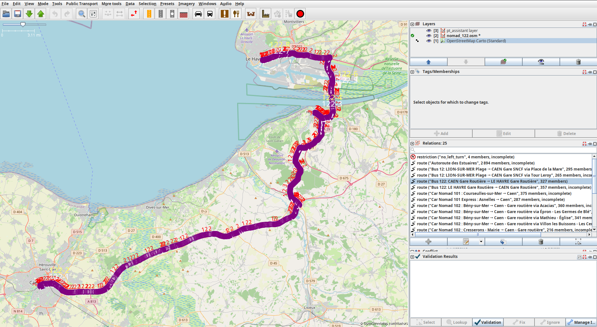

# TissWay

Generates OpenStreetMap public transport relations (PTv2) from any GTFS feed: one `route` relation per
variant, a `route_master` per line, stop_positions on the road, platforms beside it and the ways
map-matched with [Valhalla](https://github.com/valhalla/valhalla). Lines already in OSM are updated in
place rather than duplicated. Everything goes into a single `.osm` file that you review in JOSM and then
upload.

Works with any GTFS feed that follows the reference: a directory or a `.zip`, with or without `agency.txt`,
`shapes.txt`, `direction_id`, `stop_code`, `parent_station`…, with basic or extended route types, in
right-hand or left-hand traffic. A TOML profile carries the settings of one feed (paths, networks,
tagging, naming conventions). The project ships with the profile of Atoumod, the regional GTFS of Normandy
(Nomad, Twisto, Astuce…).



```text
GTFS ──► variants ──► map-matching (Valhalla) ──► stops on the ground ──► relations ──► split ways ──► .osm
          gtfs.py        matching.py                 platforms.py           build.py      splitting.py    osm.py
```

## Contents

- [Installation](#installation)
- [Quick start](#quick-start)
- [Commands](#commands)
- [Profile](#profile)
- [How it works](#how-it-works)
- [Tags written](#tags-written)
- [Review in JOSM](#review-in-josm)
- [Development](#development)
- [License](#license)

## Installation

Requirements: Python ≥ 3.11, [osmium-tool](https://osmcode.org/osmium-tool/) and Docker (for Valhalla).

```bash
sudo apt install osmium-tool docker.io
python -m pip install -e ".[dev]"      # or: make install
```

This installs the `tissway` command. `python -m tissway` works as well, without installing.

## Quick start

1. Put the GTFS feed in place, as a directory or a `.zip`.
2. Describe the feed in a profile. At least `gtfs` and either `pbf` (an OSM extract covering the feed) or
   `extracts` (URLs to download and merge):

   ```toml
   # tissway.toml
   gtfs = "gtfs.zip"
   extracts = ["https://download.geofabrik.de/europe/germany/bremen-latest.osm.pbf"]
   pbf = "bremen.osm.pbf"
   feed = "DE-HB-VBN"          # suffix of the gtfs:*:<feed> tags (PTNA feed id); optional
   ```

3. Generate the relations of a few lines and open the result in JOSM:

   ```bash
   tissway routes 1 4 N10          # -> output_osm/gtfs_1_4_n10.osm
   tissway routes -n VBN           # every line of the network "VBN" -> output_osm/vbn.osm
   ```

   `routes` first refreshes the extract (at most once a day), then starts Valhalla in Docker. When the
   extract changed, it rebuilds the routing tiles first, which can take a while the first time
   (`docker logs -f <container>` to follow).

With the Atoumod profile shipped in this repository:

```bash
make                                    # tests, then every line of every network
make NETWORK=nomad ROUTES="301 305"     # -> output_osm/nomad_301_305.osm
tissway routes -n Twisto 1 2           # same thing without make
```

## Commands

`tissway [--profile FILE] [--verbose] <command>`. The profile defaults to `$TISSWAY_PROFILE`, then to
`./tissway.toml`.

| Command | Purpose |
|---|---|
| `routes [-n NETWORK] [-l REF…] [REF…]` | PTv2 relations of the selected lines → `<output_dir>/<network>[_<refs>].osm`. `--no-download` keeps the current extract; `--no-prepare` also leaves Valhalla alone; `--new-relations` never updates existing relations |
| `platforms -n NETWORK [--feed ID] [--max-distance M]` | completes the existing OSM platforms with the GTFS stops of a network (`gtfs:stop_id:<feed>`, `gtfs:stop_name:<feed>`, `route_ref`), without relations; unmatched stops go to a CSV |
| `add-via FILE.osm [-o OUT \| --in-place]` | adds `via …` to route relations sharing a name, with as few distinguishing stops as possible |
| `ptna [LIST.txt] [-n NETWORK]` | updates (or, without a file, generates) the [PTNA](https://ptna.openstreetmap.de) route list of a network |
| `extracts [--force \| --no-download]` | downloads the extracts of the profile and merges them into `pbf` |
| `valhalla` | starts Valhalla, rebuilding its tiles when the extract changed |

Lines are selected by `route_short_name` (or `route_id`), separated by spaces or commas. Networks are
selected by the value of their `network` tag, case-insensitively. An unknown line or network stops the run
and lists the available ones.

All the lines of a run are written to one file. Ways, platforms and stop_positions are shared between
lines, so separate files would conflict on upload. Upload the file in one go.

## Profile

Every key is optional; relative paths are resolved from the profile's directory. Defaults are in
[tissway/config.py](tissway/config.py); [tissway.toml](tissway.toml) is a complete example.

| Key | Default | Meaning |
|---|---|---|
| `gtfs` | `gtfs` | GTFS directory or `.zip` |
| `pbf` | `data.osm.pbf` | OSM extract covering the feed |
| `extracts` | `[]` | URLs of `.osm.pbf` extracts downloaded (as `<name>-<YYMMDD>.osm.pbf` in `extracts_dir`) and merged into `pbf` |
| `output_dir`, `output_name` | `output_osm`, `gtfs` | output folder, and file name when no network is selected |
| `stops_cache`, `routes_cache` | `osm_bus_stops.geojsonseq`, `osm_routes.opl` | OSM platforms and route relations extracted from `pbf`; rebuilt whenever `pbf` is newer |
| `feed` | `""` | suffix of the `gtfs:*` tags (`gtfs:route_id:<feed>`…) and PTNA feed field |
| `stop_ref_tags` | `[]` | extra platform tags holding the `stop_id` (e.g. `ref:FR:Atoumod`) |
| `modes` | `["bus", "coach", "trolleybus"]` | OSM `route=*` values generated (from basic and extended GTFS route types) |
| `driving_side` | `right` | `left` in left-hand traffic: platforms are picked on the kerb side |
| `networks` | `{}` | `agency_id` (or `agency_name`) → network tags. Other agencies get `network=<agency_name>`, without the part in parentheses |
| `locality` | `none` | `insee`: prefix stop labels with the French commune (from a `FR:<INSEE>:` stop_id, else from the position) |
| `fix_accents` | `false` | restore French accents commonly dropped by producers (`Gare Routiere` → `Gare Routière`, words in [data/fr_accents.txt](tissway/data/fr_accents.txt)) |
| `update_existing` | `true` | update the existing OSM relations of a line instead of creating new ones |
| `existing_min_similarity` | 0.4 | minimum similarity (0–1) between a generated variant and an existing relation to update it |
| `[thresholds]` | | distances in metres, see below |
| `[valhalla]` | | `url`, `container`, `image`, `data_dir`, `threads`, `wait_s` |
| `[ptna]` | | `id_prefix`, `categories`, `sections`, `pages`, `text` (wiki texts replacing the English ones), see `tissway.toml` |

Thresholds:

| Key | Default | Meaning |
|---|---|---|
| `platform_m` | 20 | GTFS stop → existing OSM platform |
| `holder_m` | 100 | GTFS stop → OSM platform already carrying its `stop_id` |
| `stop_position_m` | 40 | GTFS stop → travelled way; beyond, the stop_position goes to the nearest point and is reported |
| `stop_position_reuse_m` | 30 | projection of the stop on the way → existing stop_position that may be reused |
| `stop_position_shared_m` | 10 | existing stop_position always reused within this distance of the projection |
| `duplicate_stop_m` | 5 | two GTFS stops this close are the same platform |
| `opposite_stop_m` | 30 | GTFS stop → opposite stop, for stops without `parent_station` or stop code |
| `sibling_m` | 100 | GTFS stop → other platform of the same stop |
| `max_far_stops` | 0.2 | share of stops further than `stop_position_m` from the matched shape before the shape is rejected |
| `trace_m`, `trace_points` | 150 000, 10 000 | longer shapes are matched in chunks (Valhalla limits) |

## How it works

### Variants and map-matching

For each line and direction, every distinct stop sequence becomes a variant (most frequent first). A
sequence that appears as a block inside a longer one of the same direction is left out. The variant is
matched on OSM with Valhalla:

- from its GTFS shape when it has one;
- by routing through its stops when the shape is missing, cannot be followed, or leaves more than
  `max_far_stops` of the stops away from the matched path (straight-line or misplaced shapes).

The log says which variants were routed through their stops.

### stop_positions

Each stop gets a stop_position on the travelled way, at the projection of the GTFS stop:

- an existing stop_position is reused if it is within `stop_position_reuse_m` of the projection;
- **unless it belongs to the stop across the road.** On a two-way road drawn as a single way, the
  stop_position of the opposite stop is often within reach. If it is closer to the projection of a stop
  of the same name (or the opposite platform) across the road, it is left to that stop and a new
  stop_position is created closer on the way, in front of our stop. Otherwise both directions would stop
  at the same spot;
- stops facing each other (projections within `stop_position_shared_m`) share one stop_position, and
  same-name stops on the same kerb are treated as one platform (aggregated feeds list the same platform
  under several networks);
- stop_positions only carry `public_transport=stop_position`, `bus=yes` (or `trolleybus=yes`) and
  `name`. They are shared by every route on that way, whatever its network.

### Platforms

- The platform is picked on the kerb side of the way in the direction of travel. Prefer the OSM platform
  already carrying the `stop_id`, else the nearest candidate. Without a candidate, a platform is created
  at the GTFS position.
- When the GTFS attaches a route to the stop across the road (a common error), the other platform of the
  same stop is used instead: same `parent_station`, or same stop code apart from a trailing letter
  (`12A`/`12B`) and served by the same agency, or simply very close. The stop_position then goes in
  front of that platform.
- A `stop_id` is set on a single OSM platform, even when the GTFS has one stop for both directions. That
  is the platform already carrying it, else the nearest one. The other one only gets `name` and
  `network`.
- Tags of another network are never overwritten: the value goes to `network:2`, `ref:2`… Survey tags
  (`wheelchair`, `highway`…) are only added when missing.

### Existing relations

A line already mapped in OSM is updated, not duplicated:

- **Candidates** are the existing route relations of the same mode that carry the GTFS `route_id`
  (`gtfs:route_id*`), or have the same `ref` and the same `network` (or none).
- **Pairing.** Each generated variant is paired with its most similar candidate, one to one, best pairs
  first. The similarity is 1 when the relation carries the same sample trip or shape. Otherwise it weighs
  the shared platforms at 70 % and the shared ways at 30 %, and it is 0 when the shared members come in
  reverse order (the other direction). Pairs below `existing_min_similarity` are not made.
- **Update.** A paired relation keeps its id, history and the tags the tool does not manage (`operator`,
  `wikidata`, `interval`, `note`…). Its members are replaced, the generated tags are written over its
  own, and stale GTFS references (old shape, old sample trip) are removed.
- **route_master.** The existing route_master is the one holding the paired relations, else one with the
  same mode, `ref` and `network`. It keeps its other members and gets the generated relations.
- **Nothing is deleted.** Existing relations of the line left unpaired (obsolete variants) are reported
  for review in JOSM. The same line found under another `network` is reported too, but never updated.

### Split ways

A relation must only contain what the vehicle travels. Ways are split where a line enters or leaves them
at an inner node:

- a street where a line turns halfway;
- a terminus at a stop_position in the middle of a way;
- each entry and exit of a single-way roundabout.

The cuts of every line of the file are pooled, and the longest part keeps the original id and history.
Each relation containing a split way gets the parts instead. Route relations (ours and the existing ones:
other lines, cycle routes…) get only the parts they travel, deduced from their neighbouring ways, so no
dead-end part is left behind. Other relations (street, multipolygon…) get every part. Ways passing twice
through the same node are not split, because the cut position is ambiguous.

### Names

Relations follow `Bus <ref>: <from> → <to>`, and route masters `Bus <ref>: A ↔ B` (or `A1 / A2 ↔ B` when a
line has branches). Stop labels are the GTFS names. With `locality = "insee"` they become
`LOCALITY Stop`, with the locality in capitals and without accents. Any repetition of the locality in the
stop name is removed (`Avranches - Gare` → `AVRANCHES Gare`, `Fleury Mairie` → `FLEURY-SUR-ORNE Mairie`).
Platforms, stop_positions and `from`/`to` keep the exact GTFS name.

## Tags written

- **route**: `type=route`, `route=<mode>`, `ref`, `name`, `from`, `to`, `public_transport:version=2`,
  the network tags, `colour`/`colour:text` (if in the GTFS), `gtfs:route_id`, `gtfs:trip_id:sample`,
  `gtfs:shape_id` (when matched from the shape), `ref_trips`. Every `gtfs:*` key carries the `:<feed>`
  suffix when `feed` is set.
- **route_master**: `type=route_master`, `route_master=<mode>`, `ref`, `name`, network, colours,
  `gtfs:route_id`.
- **platform**: `public_transport=platform`, `highway=bus_stop`, `bus=yes`, `name`, network,
  `gtfs:stop_id` (+ `stop_ref_tags`), `ref` (stop_code), `local_ref` (platform_code), `wheelchair`.
- **stop_position**: `public_transport=stop_position`, `bus=yes`, `name`.

No `operator` is set: the actual operator of a line (often a subcontractor) is not reliable in GTFS
feeds. Add it by hand in JOSM if you know it.

## Review in JOSM

1. Open `output_osm/<file>.osm` with the **PT Assistant** plugin and download the data around the lines.
2. Go through what the log reported:
   - gaps between ways;
   - stop_positions far from their stop;
   - platforms left across the road;
   - `stop_id`s already on another platform;
   - variants routed through their stops;
   - existing relations left unpaired or found under another network.
3. Fix what PT Assistant flags, add `operator` if known, validate and upload.

When an error comes back from the review, add a test case for it (see below).

## Development

```bash
make test     # pytest: hand-built data, no network access, no extract, < 1 s
make lint     # ruff
```

| Module | Role |
|---|---|
| [config.py](tissway/config.py) | settings and TOML profiles (every threshold lives here) |
| [gtfs.py](tissway/gtfs.py) | GTFS reading and normalisation (directory or zip, optional files and columns), route types, variants |
| [stops.py](tissway/stops.py) | GTFS stops ↔ OSM platform candidates, opposite and rival stops |
| [matching.py](tissway/matching.py) | Valhalla map-matching, fallback routing through the stops |
| [osm.py](tissway/osm.py) | extract reading (osmium), modified objects, `.osm` output |
| [platforms.py](tissway/platforms.py) | stop_position placement, platform choice, platform tags |
| [build.py](tissway/build.py) | route / route_master relations of a line |
| [existing.py](tissway/existing.py) | existing OSM relations of a line, paired and updated in place |
| [splitting.py](tissway/splitting.py) | ways split at route entries / exits |
| [naming.py](tissway/naming.py) | networks, localities, relation names, French accents |
| [geo.py](tissway/geo.py) | local geometry |
| [pipeline.py](tissway/pipeline.py) | the `routes` command end to end |
| [platform_tags.py](tissway/platform_tags.py), [via.py](tissway/via.py), [ptna.py](tissway/ptna.py) | the `platforms`, `add-via` and `ptna` commands |
| [extracts.py](tissway/extracts.py), [valhalla.py](tissway/valhalla.py) | OSM extracts, local Valhalla server |
| [cli.py](tissway/cli.py) | command line |

Every OSM object goes through `obj = ChainMap(modified, extract)`. What is created or modified lives in
`obj.maps[0]` and is written out; the objects read from the extract stay untouched below (see
[osm.py](tissway/osm.py)).

## License

TissWay is free software under the [MIT License](LICENSE): anyone may use, copy, modify and redistribute
it, for OpenStreetMap or anything else.

The data you upload to OpenStreetMap with it falls under the
[ODbL](https://www.openstreetmap.org/copyright), like all OSM data. Before importing anything, check that
the license of the GTFS feed allows it (see the
[import guidelines](https://wiki.openstreetmap.org/wiki/Import/Guidelines)), and follow the community
rules on [automated edits](https://wiki.openstreetmap.org/wiki/Automated_Edits_code_of_conduct): every
generated file is meant to be reviewed in JOSM before upload.
